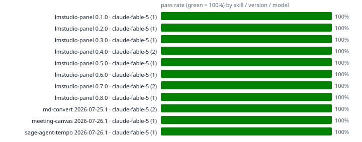

# Skill regression matrix

Auto-rendered from `telemetry/*.jsonl` (append-only run ledgers; each skill's `run_tests.py --auto --model <id>` self-caps at 8 runs per model+version). Regenerate: `python3 telemetry/render_matrix.py`.

| skill | version | model | runs | pass | duration | last run |
|---|---|---|---|---|---|---|
| lmstudio-panel | 0.1.0 | claude-fable-5 | 1 | 100% | 0.15±0.00s | 2026-07-27 |
| lmstudio-panel | 0.2.0 | claude-fable-5 | 1 | 100% | 0.24±0.00s | 2026-07-27 |
| lmstudio-panel | 0.3.0 | claude-fable-5 | 1 | 100% | 0.19±0.00s | 2026-07-27 |
| lmstudio-panel | 0.4.0 | claude-fable-5 | 2 | 100% | 0.24±0.11s | 2026-07-27 |
| lmstudio-panel | 0.5.0 | claude-fable-5 | 1 | 100% | 0.21±0.00s | 2026-07-27 |
| lmstudio-panel | 0.6.0 | claude-fable-5 | 1 | 100% | 0.21±0.00s | 2026-07-27 |
| lmstudio-panel | 0.7.0 | claude-fable-5 | 2 | 100% | 0.26±0.07s | 2026-07-27 |
| lmstudio-panel | 0.8.0 | claude-fable-5 | 1 | 100% | 0.18±0.00s | 2026-07-27 |
| md-convert | 2026-07-25.1 | claude-fable-5 | 2 | 100% | 0.76±0.27s | 2026-07-25 |
| meeting-canvas | 2026-07-26.1 | claude-fable-5 | 1 | 100% | 0.00±0.00s | 2026-07-26 |
| sage-agent-tempo | 2026-07-26.1 | claude-fable-5 | 1 | 100% | 0.08±0.00s | 2026-07-26 |
